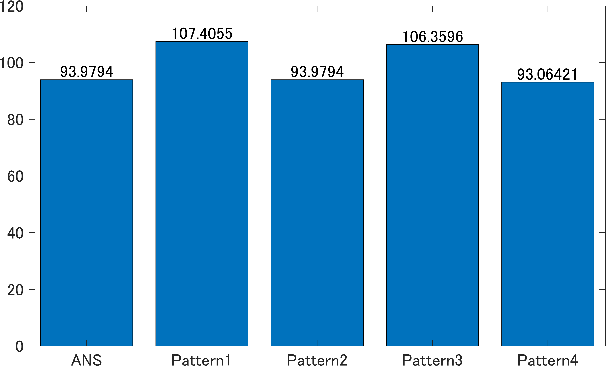

## 0パディングによる補正
0パディングは基本的に周波数分解能を上げるために用いられる。
しかし本来は存在しないデータ点を作っているため、
PSによるパワー推定を行う場合はその値を補正する必要がある。

## 結論
0パディングによる補正係数を求め、
Windowを併用した場合はWindowのエネルギー補正も行う必要がある。
0パディングの補正係数を求める際はWindowを利用してはいけない。

|&nbsp;&nbsp;&nbsp;&nbsp;名前&nbsp;&nbsp;&nbsp;&nbsp;|ACF|ECF|0pad CF|
|:---:|---|---|---|
|Pattern1|適用する|適用する|適用しない|
|Pattern2|適用する|適用しない|適用しない|
|Pattern3|適用しない|適用する|適用しない|
|Pattern4|適用しない|適用しない|適用しない|
|Pattern5|適用する|適用する|適用する|
|Pattern6|適用する|適用しない|適用する|
|Pattern7|適用しない|適用する|適用する|
|Pattern8|適用しない|適用しない|適用する|

ちなみに、当たり前だがピーク値には変化はない。

### ガウスノイズでPSから全パワーを算出した場合

### 純音でPSからピーク値を算出した場合

