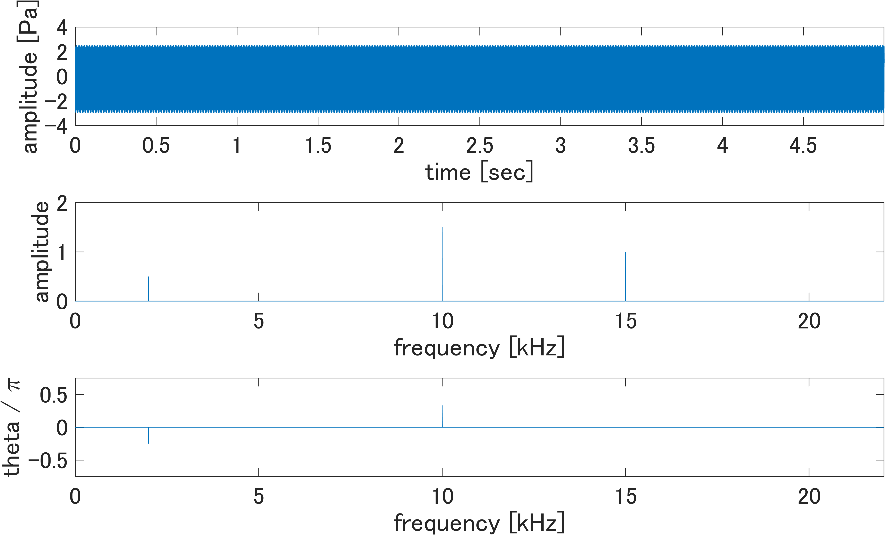

## パワーとエネルギーについて
皆さんはパワーとエネルギーの違いについて説明できますか？
そんなのは義務教育で習ったよ。という方がほどんどだと思います。
では以下のような定義域外はすべて0と仮定した、
周期信号のパワーとエネルギーをそれぞれ求めてください。

求められましたか？
求められた方は少しお付き合いください。
実はこれを書いている本人も大学4年生になるまで求められませんでした。
それは定義を知らないからです。
皆さんがパワー、エネルギーと聞いたら物理の球を持ち上げるとか、
そういうことを想像すると思います。
僕もそうでした。そんなことでは信号のパワーなんて求められませんね。
基本的にパワーとは二乗平均値のことを指します。
そして、エネルギーとは二乗平均値に時間を乗じたものを指します。
なので、パワーを

エネルギーを

としたとき、

となります。

## フーリエ変換、振幅スペクトル、位相スペクトル
ここで、フーリエ変換を行うとその信号の振幅情報と位相情報を取り出すことができます。

から振幅情報と位相情報を取り出してみましょう。取り出すと以下の図のようになります。
[code](../prog/ps/ex3.m)

コードの説明ですが、`Y = fft(y);`でフーリエスペクトルを求めています。
[MATLABの公式ドキュメント-fft](https://jp.mathworks.com/help/matlab/ref/fft.html)
に書かれていますが、求められる`Y`は両側スペクトルなので、片側スペクトルに変換を行っています。
また、フーリエスペクトルから複素フーリエ係数に変換した後に
片側スペクトル
に対して、振幅スペクトルは
であり、位相スペクトルは
と表せられるので、それらを描写して振幅情報と位相情報を取り出しが出来ました。

## フーリエ変換、パワースペクトル
