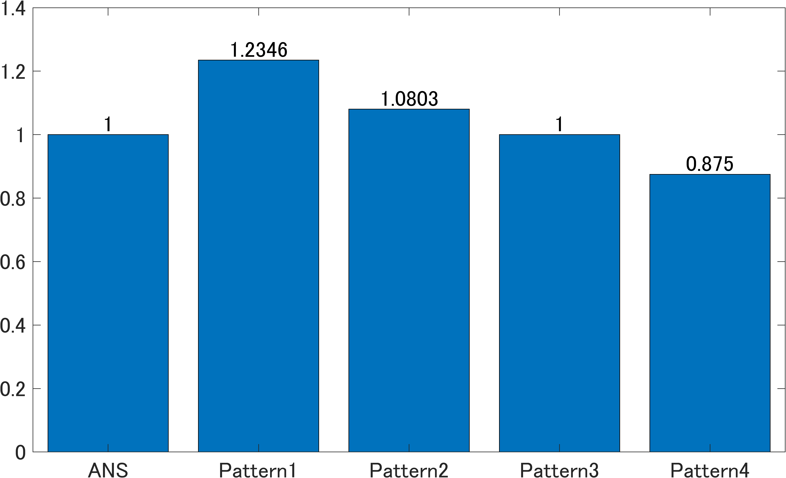

## 窓関数について
窓関数を使用する際は、振幅とエネルギーに対して補正を行わないといけない。
それぞれ、amplitude correction factor、energy correction factorと呼ばれる。

## 行ったこと
パワーを求めるときには`rms`を用いて二乗平均値を算出する方法と、
PSの合計値を求める場合の二つの場合がある。
また周期信号の場合はピーク値が重要である。
ここで、窓関数を利用した場合の、
周期信号と非周期信号のピーク値と合計パワーの変化について考察する。

## 結果
|&nbsp;&nbsp;&nbsp;&nbsp;名前&nbsp;&nbsp;&nbsp;&nbsp;|ACF|ECF|
|:---:|---|---|
|Pattern1|適用する|適用する|
|Pattern2|適用する|適用しない|
|Pattern3|適用しない|適用する|
|Pattern4|適用しない|適用しない|

結果として、PSを表示する場合はACFのみを適用させる。
エネルギー計算をする場合はACFを適用せずに、ECFのみを適用させる。

### 純音でRMSから全パワーを算出した場合

### 純音でPSからピーク値を算出した場合

### ガウスノイズでRMSから全パワーを算出した場合

### ガウスノイズでPSから全パワーを算出した場合

